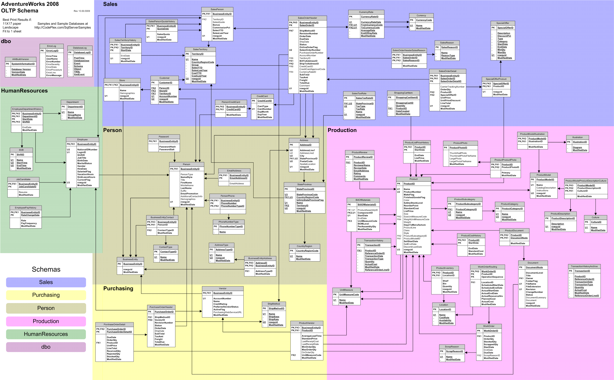

# 📂 Proyecto Final: Administración de Bases de Datos (SQL Server)

Este documento contiene la referencia y requerimientos para el proyecto final de la materia **Administración de Bases de Datos**.

---

## 📋 Información General

| Campo | Detalle |
| :--- | :--- |
| **Programa Educativo** | Ingeniería de Software |
| **Periodo** | Febrero – Julio 2026 |
| **Puntaje Máximo** | 100 pts. |
| **Fecha de Entrega** | ⏳ Pendiente |

---

## 🎯 Objetivo

Implementar un modelo de base de datos optimizado mediante una adecuada gestión de recursos y una correcta asignación de permisos, garantizando así la operatividad y seguridad del sistema. Este proyecto busca que los estudiantes apliquen de forma integral los conocimientos adquiridos durante el curso de **Administración de Bases de Datos**.

---

## 🛠️ Actividades por Realizar

### 1. Restauración de la Base de Datos `(5 pts)`
- [ ] **Restauración completa**: Restaurar completamente la base de datos **"AdventureWorks"** proporcionada.
- [ ] **Limpieza inicial**: Eliminar todos los procedimientos almacenados predeterminados una vez finalizada la restauración.

---

### 2. Creación y Administración de Usuarios `(15 pts)`
- [ ] **Usuario Administrador**: Crear un usuario administrador con control total sobre la base de datos.
- [ ] **Usuarios por Área Funcional**: Crear usuarios con permisos de lectura y escritura para cada área funcional identificada en la base de datos.
  - [ ] Garantizar contraseñas seguras de mínimo 12 caracteres que incluyan letras y números.
- [ ] **Usuario de Respaldos**: Crear un usuario exclusivo para la generación de respaldos.

---

### 3. Procedimientos Almacenados y Funciones `(35 pts)`

#### **Operaciones CRUD**
Desarrollar procedimientos almacenados para insertar, actualizar y eliminar registros para las siguientes tablas:
- [ ] Tabla **`Employee`** (Recursos Humanos)
- [ ] Tabla **`Product`** (Producción)
- [ ] Tabla **`Customer`** (Ventas)

#### **Consultas con Funciones Escalares**
Crear consultas que devuelvan la información especificada utilizando funciones escalares para los cálculos requeridos:
- [ ] **Información básica del Empleado**:
  - Datos a retornar: `Id`, `FirstName`, `MiddleName`, `JobTitle`, `BirthData`, `MaritalStatus`, `Gender`.
  - Requisito: Calcular la edad a partir de la fecha de nacimiento usando una función escalar.
- [ ] **Información de Productos**:
  - Datos a retornar: `Id`, `Name`, `ProductNumber`.
  - Requisito: Calcular el precio con impuesto (aplicando un IVA del 16% a la lista de precios) usando una función escalar.
- [ ] **Información de Clientes**:
  - Datos a retornar: `Id`, `FirstName`, `MiddleName`, `AccountNumber`, `CreditLimit`.
  - Requisito: Retornar `'Aprobado'` o `'No aprobado'` basado en un límite de crédito de `7500` usando una función escalar.

> [!IMPORTANT]
> **Requerimientos de los Procedimientos Almacenados:**
> * **Consultas Flexibles:** Permitir obtener uno o todos los registros dentro del mismo procedimiento de consulta.
> * **Códigos de Estado:** Las operaciones de inserción, actualización y eliminación deben devolver los siguientes códigos:
>   * `200` para éxito.
>   * `400` para registros duplicados o faltantes.
>   * `500` para errores internos.
> * **Mensajes Descriptivos:** Retornar mensajes que indiquen claramente el resultado o el error específico.
> * **Identificadores:** Generar y retornar el identificador del registro insertado cuando aplique.
> * **Robustez y Transacciones:** Implementar manejo de errores mediante estructuras `TRY-CATCH`, y control de transacciones con `COMMIT` y `ROLLBACK` para asegurar la integridad de los datos.
> * **Estándar:** Uso estricto del lenguaje **ANSI SQL**.

---

### 4. Vistas `(25 pts)`
Crear las siguientes vistas para consolidar información relevante:
- [ ] **Vista 1 (Empleados y Departamentos):** Devolver la información básica de los empleados junto con su departamento correspondiente.
- [ ] **Vista 2 (Contacto y Métodos de Pago):** Mostrar personas con su dirección de correo electrónico, teléfono, tipo de teléfono e información de tarjeta de crédito.
- [ ] **Vista 3 (Clientes y Territorios):** Incluir los clientes (`Customers`) con sus respectivos territorios asignados.

---

### 6. Implementación de un Modelo API REST `(20 pts)`
- [ ] **Desarrollo de la API:** Generar un modelo de API REST en el lenguaje de su elección.
- [ ] **Operaciones Requeridas:** El API deberá poder realizar las operaciones CRUD consumiendo los procedimientos transaccionales y de consulta desarrollados para la tabla de **productos** (`Product`):
  - [ ] **Insertar** (`POST`)
  - [ ] **Actualizar** (`PUT`)
  - [ ] **Eliminar** (`DELETE`)
  - [ ] **Consultar** (`GET` individual / todos)

---

## 📦 Requisitos de Entrega

La entrega del proyecto deberá incluir lo siguiente:
* [ ] **Archivo .ZIP:** Conteniendo el respaldo completo (`.bak`) de la base de datos ya configurada.
* [ ] **Presentación Final:**
  * **Fecha:** 📅 `_____ de junio de 2026`
  * **Tiempo límite:** Máximo 20 minutos por equipo.
  * **Dinámica:** Exposición de la solución implementada y pruebas en vivo (incluyendo el consumo del API REST).

---

## 📊 Diagrama de la Base de Datos

---

## 🔗 Recursos y Enlaces

* 💾 [Descargar Base de Datos AdventureWorks](https://drive.google.com/file/d/1lwila-guUwA1A6WOgP9HbKcHP0winRps/view)
* 📊 [Ver Diagrama de Base de Datos Completo](https://www.businessintelligence.info/resources/imagenes-bi/adventureworks2008_schema.gif) / [Espejo Local (GIF)](./DB-DIAGRAM.gif)

---

## 📅 Revisión de Avances

* [ ] **Avance 1:** 04 de junio del 2026